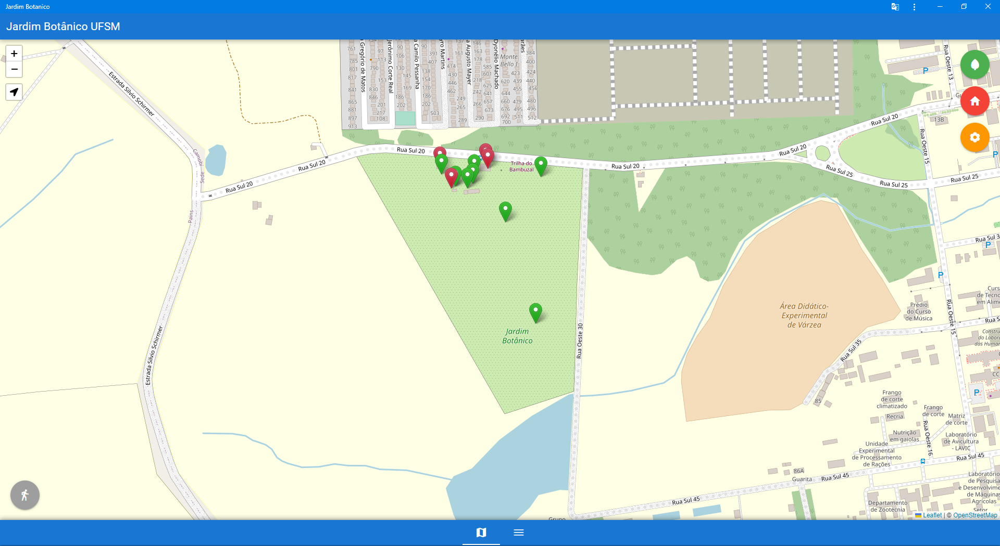

# Jardim Botânico da UFSM

.

#### Descrição

O projeto visa oferecer uma ferramenta que facilite e oriente visitas ao Jardim Botânico da UFSM através da exposição dos seus itens de diferentes maneiras. 
Atrativos podem ser observados no mapa individualmente, trilhas podem ser seguidas e o acervo completo consultado.

#### Deploy

https://jardimbotanicoufsm.surge.sh

#### Testes

- Consulta de acervo
- Consulta de detalhes dos pontos no mapa
- Filtragem
- Consulta de trilhas
- Geolocalização
- Instalação do pwa mobile/pc

#### Desenvolvedor(es)
Roberto José Mahl

#### Tecnologias

- Quasar
- Vue 3
- Google API

### Fonte de dados

Original: https://docs.google.com/spreadsheets/d/1-3t23mTmuvJaVK6NAN-ivBr9fbE8NGZ6RNMQPwvd_oc
Cópia manipulada: https://docs.google.com/spreadsheets/d/1SELKTKPVt44lT-Go6mOJ9L43viJ2GXC9aco19VEf2A4

#### Ambiente de desenvolvimento

- GitHub
- VSCode
- Figma
- Google Sheets

#### Créditos

Pacote de ícones:
- https://ionic.io/ionicons/v4

Leaflet e plugins:
- https://leafletjs.com
- https://github.com/pointhi/leaflet-color-markers
- https://github.com/domoritz/leaflet-locatecontrol

Deployment:
-	https://surge.sh/

Tutorial Quasar:
- https://medium.com/zarv/criando-um-pwa-com-framework-vue-js-e-quasar-6b7e1fbc743d

#### Bastidores

Foi meu primeiro trabalho com um front-end mais moderno, utilizando componentes e um framework de fato. A curva de aprendizagem foi boa, gostei de usar Vue e o Quasar parece facilitar muito o desenvolvimento. Chat GPT foi um grande aliado nesse projeto; apesar das muitas bolas curvas, me ajudou bastante a contextualizar e, às vezes, dar dicas mais específicas para a stack que escolhi. 

Acabei criando uma cópia da fonte de dados original devido à falta de estruturação nos dados que estavam sendo adicionados progressivamente. Nessa cópia, removi alguns dados e repliquei outros, para que houvesse maior volume de dados.

Poder consultar no protótipo disponibilizado no Figma foi ótimo, ainda que esteja um pouco defasado dados os requisitos atuais. Inclusive me ajudou a perceber que o que menos gostava no desenvolvimento FE, quando trabalhava com isso, não era o desenvolvimento em si, e sim o design.

Não houve nenhuma parte que se destaque consideravelmente em questão de nível de dificuldade, mas o projeto inteiro por si custou bastante pesquisa em documentações. Destaco que a ferramenta de deploy foi ótima e muito simples de usar.

Há detalhes de usabilidade que, com certeza, poderiam ser melhorados numa próxima versão. Não me aventurei com o service worker também, o que torna a aplicação um pwa extremamente simples. Ainda assim, acho que o resultado foi consistente e fiquei feliz com a minha produção :)

---
Projeto entregue para a disciplina de [Desenvolvimento de Software para a Web](http://github.com/andreainfufsm/elc1090-2023a) em 2023a
